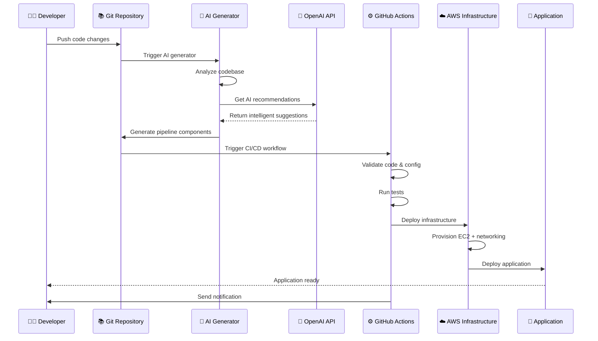
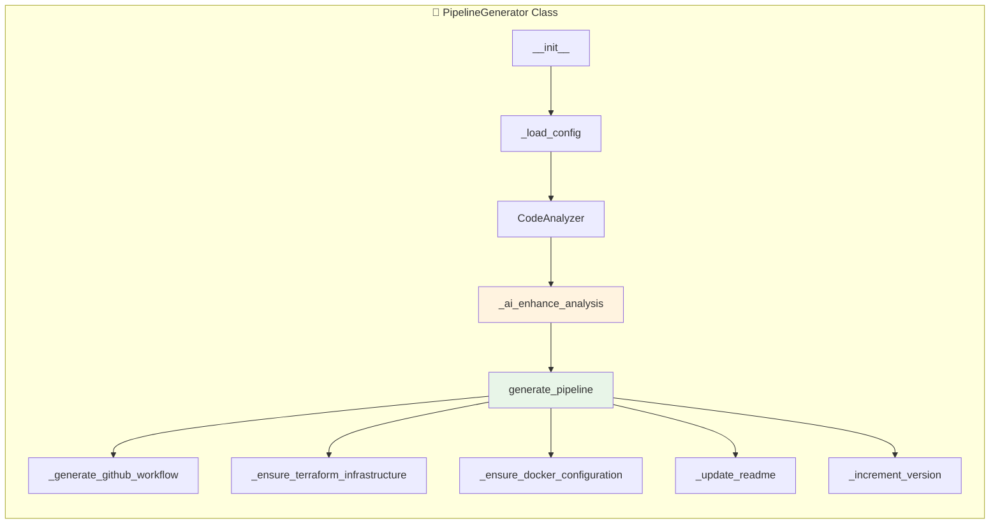
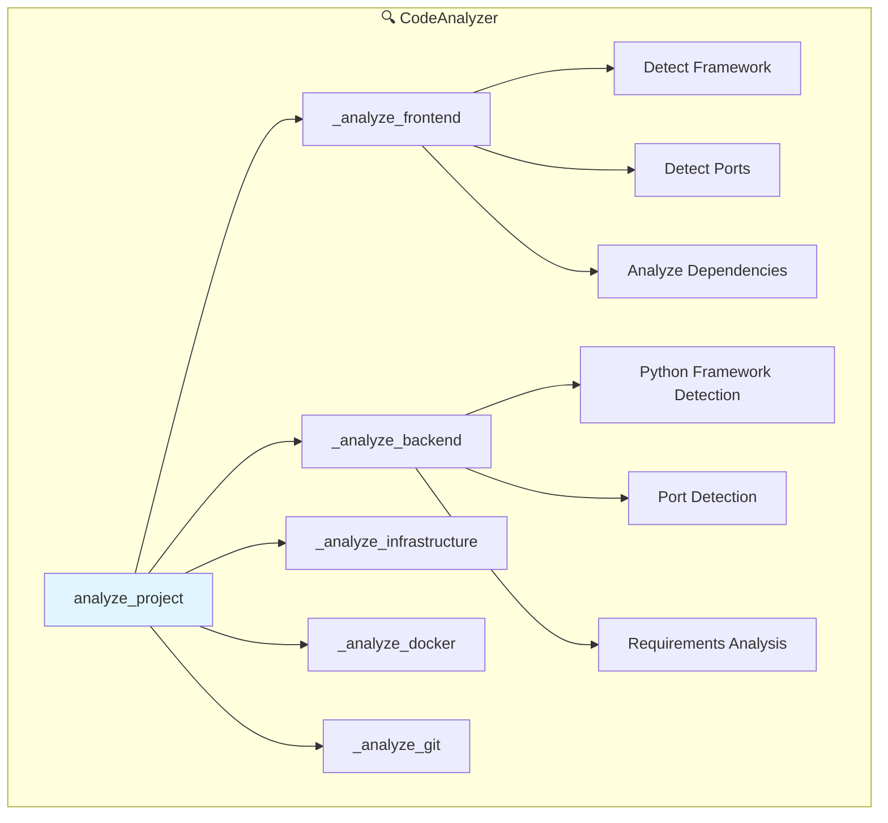
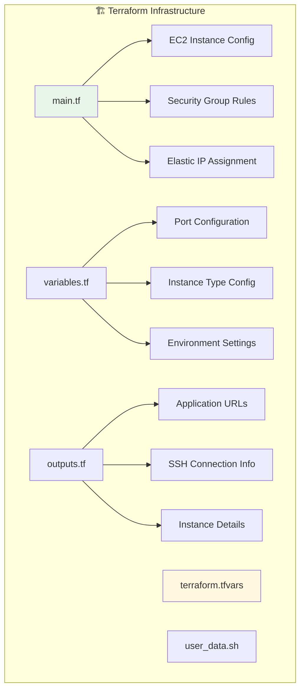
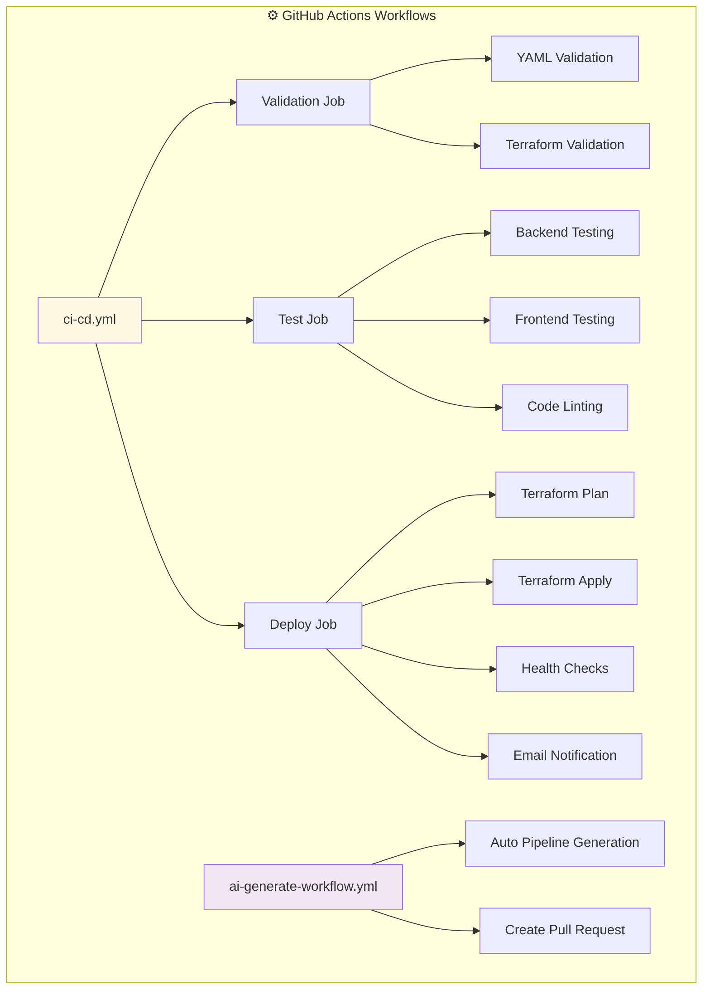
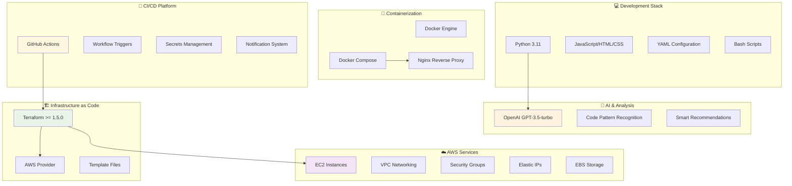
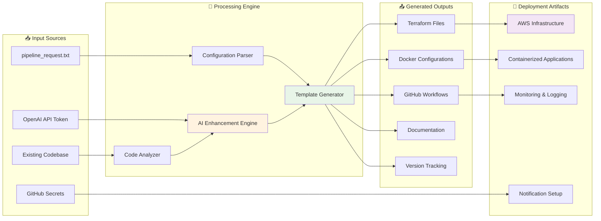
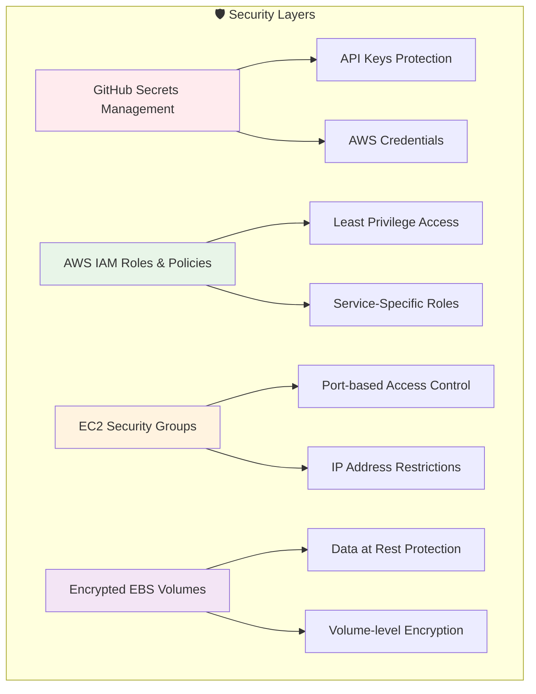

# QR Code Generator - AI-Powered CI/CD Demo

This project demonstrates **AI-assisted DevOps automation** with a complete CI/CD pipeline that automatically analyzes code and generates infrastructure.

## 🎯 Project Overview

**QR Code Generator** is a full-stack web application that generates QR codes from various data types:
- Plain text
- URLs
- Email addresses  
- Phone numbers
- WiFi credentials

### Architecture

- **Frontend**: node (8000 port)
- **Backend**: fastapi (8000 port)
- **Infrastructure**: AWS EC2 with Terraform
- **Deployment**: Docker Compose
- **CI/CD**: GitHub Actions with AI-generated workflows

## 🚀 Quick Start

### Prerequisites

- AWS Account with CLI configured
- Docker and Docker Compose
- Terraform >= 1.5.0
- Python 3.11+
- Git

### Local Development

1. **Clone the repository**:
   ```bash
   git clone <repository-url>
   cd AISDLC2.0
   ```

2. **Run locally with Docker Compose**:
   ```bash
   docker-compose up -d
   ```

3. **Access the application**:
   - Frontend: http://localhost:3000
   - Backend API: http://localhost:8000
   - API Documentation: http://localhost:8000/docs

### AWS Deployment

1. **Configure AWS credentials**:
   ```bash
   aws configure
   ```

2. **Set up Terraform variables**:
   ```bash
   cd terraform
   cp terraform.tfvars.example terraform.tfvars
   # Edit terraform.tfvars with your preferences
   ```

3. **Deploy to AWS**:
   ```bash
   terraform init
   terraform plan
   terraform apply
   ```

4. **Get deployment URLs**:
   ```bash
   terraform output application_urls
   ```

## 🤖 AI Pipeline Generator

The `generate_workflow.py` script automatically:

### Code Analysis
- Detects programming languages and frameworks
- Identifies dependencies and test commands
- Analyzes port configurations
- Suggests optimal CI/CD strategies

### Infrastructure Generation
- Creates Terraform configurations for AWS EC2
- Generates Docker and Docker Compose files
- Sets up security groups and networking
- Configures auto-scaling and monitoring

### Pipeline Automation  
- Generates GitHub Actions workflows
- Sets up automated testing and linting
- Configures deployment strategies
- Implements rollback mechanisms

### Usage

```bash
# Run the AI generator
python generate_workflow.py

# Run with auto-commit (for CI/CD)
python generate_workflow.py --auto-commit

# Analyze only (no file generation)
python generate_workflow.py --analyze-only
```

## 📁 Project Structure

```
.
├── README.md                          # This file
├── VERSION                            # Version tracking
├── pipeline_request.txt              # AI pipeline configuration
├── generate_workflow.py              # AI pipeline generator
├── docker-compose.yml               # Local development setup
├── frontend/                        # Frontend application
│   ├── index.html                  # Main HTML file
│   ├── script.js                   # JavaScript logic
│   ├── style.css                   # Styling
│   ├── Dockerfile                  # Frontend container
│   └── nginx.conf                  # Nginx configuration
├── backend/                         # Backend API
│   ├── main.py                     # FastAPI application
│   ├── requirements.txt            # Python dependencies
│   ├── Dockerfile                  # Backend container
│   └── api/                        # API modules
├── terraform/                       # Infrastructure as Code
│   ├── main.tf                     # Main Terraform configuration
│   ├── variables.tf                # Variable definitions
│   ├── user_data.sh               # EC2 initialization script
│   └── terraform.tfvars.example   # Example configuration
└── .github/workflows/              # CI/CD pipelines
    ├── ci-cd.yml                   # Main deployment workflow
    └── ai-generate-workflow.yml    # AI generator trigger
```

## 🔄 CI/CD Workflow

The AI-generated pipeline includes:

### 1. **Validation Stage**
- YAML syntax validation
- Terraform formatting and validation  
- Code linting and security scanning

### 2. **Testing Stage**
- Backend API testing with pytest
- Frontend testing (if configured)
- Integration testing
- Security vulnerability scanning

### 3. **Deployment Stage**
- Terraform infrastructure provisioning
- Docker image building and pushing
- AWS EC2 deployment via user data script
- Health checks and monitoring setup

### 4. **Notification Stage**
- Email notifications on success/failure
- Slack/Teams integration (configurable)
- Deployment status reporting

## ⚙️ Configuration

### Pipeline Configuration (`pipeline_request.txt`)

```yaml
pipeline_name: qr-generator-auto-pipeline
environment: production
target: aws_ec2
instance_type: t2.micro
deploy_using: docker-compose
labels: [ai-generated, demo]
email_notification: true
email_recipient: your-email@example.com
```

### GitHub Secrets Required

- `AWS_ACCESS_KEY_ID`: AWS access key
- `AWS_SECRET_ACCESS_KEY`: AWS secret key
- `EMAIL_USERNAME`: SMTP username (optional)
- `EMAIL_PASSWORD`: SMTP password (optional)

## 🛡️ Security Features

- EC2 security groups with minimal required ports
- Encrypted EBS volumes
- IAM roles with least privilege
- Container security scanning
- Secrets management via GitHub Secrets

## 📊 Monitoring & Logging

- CloudWatch monitoring for EC2 instances
- Application health checks
- Docker container logs
- Terraform state management
- Automated backup and recovery

## 🧹 Cleanup

To destroy the AWS infrastructure:

```bash
cd terraform
terraform destroy
```

To stop local development:

```bash
docker-compose down -v
```

## 🔧 Troubleshooting

### Common Issues

1. **AWS Permissions**: Ensure your AWS user has EC2, VPC, and IAM permissions
2. **Terraform State**: Use remote state storage for team collaboration
3. **Docker Build**: Check Dockerfile syntax and dependency availability
4. **Port Conflicts**: Ensure ports 3000, 8000, 80 are available

### Debug Commands

```bash
# Check application logs
docker-compose logs -f

# SSH into EC2 instance
ssh -i qr-generator-private-key.pem ubuntu@<instance-ip>

# Check Terraform state
terraform show

# Validate Terraform configuration
terraform validate
```

## 🤝 Contributing

This is a demo project showcasing AI-assisted DevOps. Contributions are welcome:

1. Fork the repository
2. Create a feature branch
3. Commit your changes
4. Push to the branch
5. Create a Pull Request

## 📝 License

This project is licensed under the MIT License - see the LICENSE file for details.

## 🙏 Acknowledgments

- **FastAPI**: Modern Python web framework
- **Terraform**: Infrastructure as Code
- **GitHub Actions**: CI/CD automation
- **AWS**: Cloud infrastructure
- **Docker**: Containerization platform

---

**Generated by**: AI-Powered Pipeline Generator v1.0
**Last Updated**: 2025-10-08 17:46:11
**Project Version**: 0.1.28

# AI-Powered CI/CD Architecture Diagram

## 🏗️ System Architecture Overview

```mermaid
graph TB
    %% Developer Workflow
    DEV[👨‍💻 Developer] --> GIT[📚 Git Repository]
    
    %% AI Pipeline Generator
    subgraph "🤖 AI Pipeline Generation"
        PIPELINE[generate_workflow.py]
        OPENAI[🧠 OpenAI API]
        CONFIG[📋 pipeline_request.txt]
        
        PIPELINE --> OPENAI
        CONFIG --> PIPELINE
    end
    
    %% Code Analysis
    subgraph "🔍 Code Analysis Engine"
        ANALYZER[CodeAnalyzer]
        FRONTEND_SCAN[Frontend Scanner]
        BACKEND_SCAN[Backend Scanner]
        INFRA_SCAN[Infrastructure Scanner]
        DOCKER_SCAN[Docker Scanner]
        
        ANALYZER --> FRONTEND_SCAN
        ANALYZER --> BACKEND_SCAN
        ANALYZER --> INFRA_SCAN
        ANALYZER --> DOCKER_SCAN
    end
    
    %% Generated Components
    subgraph "📁 Generated DevOps Components"
        TERRAFORM[🏗️ Terraform IaC]
        GITHUB_ACTIONS[⚙️ GitHub Actions]
        DOCKER_COMPOSE[🐳 Docker Compose]
        README[📖 Documentation]
    end
    
    %% CI/CD Pipeline
    subgraph "🚀 GitHub Actions Workflow"
        VALIDATE[✅ Validation Job]
        TEST[🧪 Test Job]
        DEPLOY[🚀 Deploy Job]
        NOTIFY[📧 Notification]
        
        VALIDATE --> TEST
        TEST --> DEPLOY
        DEPLOY --> NOTIFY
    end
    
    %% AWS Infrastructure
    subgraph "☁️ AWS Cloud Infrastructure"
        EC2[🖥️ EC2 Instance]
        SG[🛡️ Security Group]
        EIP[🌐 Elastic IP]
        EBS[💾 EBS Volume]
        
        EC2 --> SG
        EC2 --> EIP
        EC2 --> EBS
    end
    
    %% Application Stack
    subgraph "📱 QR Generator Application"
        NGINX[🌐 Nginx Proxy]
        FRONTEND_APP[🎨 Frontend\n(Vanilla JS)]
        BACKEND_APP[🔧 Backend\n(FastAPI)]
        
        NGINX --> FRONTEND_APP
        NGINX --> BACKEND_APP
    end
    
    %% Connections
    GIT --> PIPELINE
    PIPELINE --> ANALYZER
    ANALYZER --> TERRAFORM
    ANALYZER --> GITHUB_ACTIONS
    ANALYZER --> DOCKER_COMPOSE
    ANALYZER --> README
    
    GIT --> GITHUB_ACTIONS
    GITHUB_ACTIONS --> VALIDATE
    TERRAFORM --> EC2
    EC2 --> NGINX
    
    style DEV fill:#e1f5fe
    style PIPELINE fill:#f3e5f5
    style OPENAI fill:#fff3e0
    style EC2 fill:#e8f5e8
    style GITHUB_ACTIONS fill:#fff8e1
```

## 🔄 Detailed Workflow Architecture



## 🎯 Component Architecture Details

### 1. AI Pipeline Generator Core



### 2. Code Analysis Engine



### 3. Infrastructure Generation



### 4. CI/CD Pipeline Structure



## 🔧 Technology Stack Architecture



## 📊 Data Flow Architecture



## 🔐 Security Architecture



This architecture diagram shows how the AI-powered CI/CD pipeline generator creates a comprehensive DevOps automation system that can intelligently analyze codebases, generate infrastructure, and deploy applications with minimal human intervention.

**Key Architectural Benefits:**
- 🤖 **AI-Driven**: Intelligent code analysis and recommendations
- 🔄 **Fully Automated**: End-to-end pipeline generation
- 🏗️ **Infrastructure as Code**: Reproducible and version-controlled infrastructure
- 🚀 **Cloud-Native**: Designed for modern cloud deployment
- 🔐 **Security-First**: Built-in security best practices
- 📊 **Observable**: Comprehensive monitoring and logging